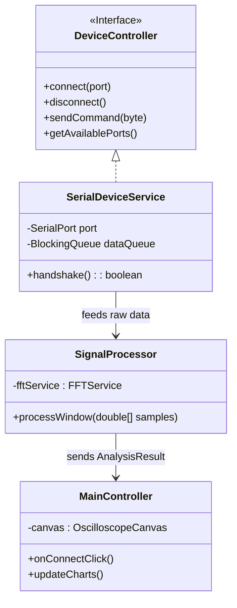

# Dokumentacja Architektury Systemu

## 1\. Przegląd Systemu

System realizuje akwizycję, przetwarzanie i wizualizację sygnałów analogowych z wysoką częstotliwością próbkowania. Projekt podzielony jest na dwie niezależne warstwy:

1.  **Firmware ("Bulletproof Core"):** Oprogramowanie wbudowane (C/AVR) odpowiedzialne za deterministyczne próbkowanie, bezpieczeństwo systemu i transmisję danych.
2.  **Software (Java 21+):** Aplikacja desktopowa odpowiedzialna za sterowanie urządzeniem, cyfrowe przetwarzanie sygnałów (DSP/FFT) oraz wizualizację (JavaFX Canvas).

-----

## 2\. Protokół Komunikacyjny (Interface Hardware-Software)

System wykorzystuje niestandardowy, binarny protokół komunikacyjny zoptymalizowany pod kątem minimalnych opóźnień (Low Latency) i wysokiej przepustowości.

### 2.1. Parametry Łącza Fizycznego

  * **Standard:** UART (RS-232 over USB)
  * **Baud Rate:** **2 000 000 bps (2 Mbps)**
      * *Uzasadnienie:* Pozwala na przesył do 200 KB/s, eliminując wąskie gardło dla próbkowania 20 kHz (wymagane 40 KB/s).
  * **Format:** 8N1 (8 data bits, No parity, 1 stop bit).

### 2.2. Sterowanie (Command & Control)

Aplikacja Java steruje urządzeniem wysyłając jednobajtowe komendy.

| Komenda (HEX) | ASCII | Funkcja | Opis |
| :--- | :--- | :--- | :--- |
| `0x3F` | `?` | **Handshake** | Weryfikacja tożsamości urządzenia. Odpowiedź: `OSC_V1\n` + `CRC8`. |
| `0x01` | - | **START** | Rozpoczęcie transmisji danych ADC. |
| `0x02` | - | **STOP** | Zatrzymanie transmisji (tryb IDLE). |
| `0x10` | - | **RATE\_1K** | Ustawienie próbkowania na 1 kHz. |
| `0x11` | - | **RATE\_10K** | Ustawienie próbkowania na 10 kHz. |
| `0x12` | - | **RATE\_20K** | **Turbo Mode.** Próbkowanie 20 kHz (Prescaler ADC = 32). |

### 2.3. Format Danych (Strumień ADC)

Próbki 10-bitowe (0-1023) wysyłane są jako 2 bajty. Zastosowano mechanizm synchronizacji bitowej (Bit 7), aby zapobiec desynchronizacji strumienia.

| Bajt | Opis | Struktura Bitowa |
| :--- | :--- | :--- |
| **High Byte** | Starsze bity + Sync | `1 0 0 0 0 0 d9 d8` (Bit 7 zawsze `1`) |
| **Low Byte** | Młodsze bity | `0 d7 d6 d5 d4 d3 d2 d1 d0` (Bit 7 zawsze `0`) |

-----

## 3\. Architektura Firmware (AVR ATmega328P)

Firmware został zaprojektowany w podejściu "Safety-Critical", bez użycia blokujących funkcji `delay` oraz bibliotek Arduino.

### Kluczowe Mechanizmy:

1.  **Watchdog Timer (WDT):**
      * Systemowy bezpiecznik ustawiony na 2 sekundy. Jeśli pętla główna się zawiesi, następuje twardy reset mikrokontrolera.
2.  **High-Speed UART Driver:**
      * Ręczna konfiguracja rejestrów `UBRR0` i `U2X0` dla prędkości 2 Mbps (błąd zegarowy 0.0%).
      * Zabezpieczenie przed **Buffer Overflow**: W przypadku przepełnienia bufora kołowego (TX Ring Buffer), dane są odrzucane, a Dioda Błędu (L) sygnalizuje utratę danych.
3.  **Turbo ADC Sampling:**
      * Dla trybu 20 kHz zmieniany jest dynamicznie Prescaler ADC na wartość **32** (zamiast standardowego 128), co skraca czas konwersji do 26 µs, umożliwiając stabilne próbkowanie.
4.  **Handshake Integrity:**
      * Odpowiedź identyfikacyjna zawiera sumę kontrolną (XOR Checksum), co gwarantuje, że Software łączy się z właściwym sprzętem.

-----

## 4\. Architektura Aplikacji Java

Aplikacja realizuje wzorzec **MVC** z wyraźnym podziałem na wątki (concurrency-aware).

### 4.1. Stack Technologiczny

  * **Java 21:** Wykorzystanie `Records` (dla DTO) i nowoczesnego switcha.
  * **jSerialComm:** Biblioteka do komunikacji natywnej (Windows/Linux) z obsługa dużych prędkości.
  * **JTransforms:** Wielowątkowa biblioteka FFT (Double Precision).
  * **JavaFX (Canvas):** Rendering sprzętowy wykresów w czasie rzeczywistym.

### 4.2. Diagram Klas (Kluczowe Komponenty)

### 4.3. Opis Warstw

1.  **Hardware Abstraction Layer (HAL):**
      * Klasa `SerialDeviceService`. Odpowiada za "negocjacje" z hardwarem (Handshake). Jeśli suma kontrolna się nie zgadza, odmawia połączenia.
2.  **Data Processing Layer:**
      * Klasa `SignalProcessor`. Działa w osobnym wątku. Gromadzi surowe próbki w okna (np. 1024 lub 2048). Wykonuje FFT i oblicza parametry statystyczne (RMS, Max, Min).
3.  **Presentation Layer:**
      * Wykorzystuje `AnimationTimer` lub `Platform.runLater` do odświeżania płótna `Canvas` z częstotliwością \~60 FPS. Rysowanie odbywa się metodą `strokePolyline` dla maksymalnej wydajności.

-----

## 5\. Przepływ Danych (Data Flow Pipeline)

System działa jako potok przetwarzania danych (Pipeline):

1.  **Źródło (ATmega328P):** Próbkowanie 20 kHz -\> UART 2 Mbps.
2.  **Transport (USB/OS):** Bufor systemowy OS -\> `jSerialComm`.
3.  **Ingest (Java Thread 1):** Odbiór bajtów -\> Parsowanie (High/Low byte) -\> `LinkedBlockingQueue`.
4.  **Processing (Java Thread 2):** Pobranie z kolejki -\> Okno czasowe -\> FFT (JTransforms).
5.  **Rendering (JavaFX Thread):** Wyczyszczenie ekranu -\> Narysowanie nowej klatki.

## 6\. Ograniczenia Teoretyczne

  * **Maksymalne próbkowanie:** \~38 kSps (limit sprzętowy ADC przy prescalerze 32). Obecnie programowo ograniczone do 20 kSps dla stabilności.
  * **Pasmo przenoszenia (Nyquist):** 10 kHz (przy próbkowaniu 20 kHz).
  * **Rozdzielczość:** 10-bit (4.88 mV na działkę przy 5V).