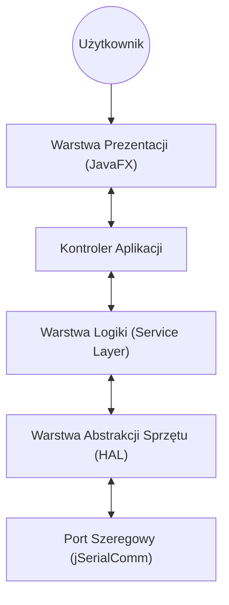

# Dokumentacja Architektury Systemu: Real-time Signal Analyzer (RTSA)

## 1. Przegląd Systemu
System realizuje akwizycję, przetwarzanie i wizualizację sygnałów analogowych w czasie rzeczywistym. Projekt podzielony jest na dwie niezależne warstwy sprzętowe i programowe:
1.  **Firmware (AVR C):** Odpowiedzialny za deterministyczne próbkowanie sygnału i transmisję binarną.
2.  **Software (Java 21+ / JavaFX):** Odpowiedzialny za odbiór danych, cyfrowe przetwarzanie sygnałów (DSP/FFT) oraz prezentację wyników (GUI).

---

## 2. Protokół Komunikacyjny (Interface Hardware-Software)

Aby zapewnić minimalne opóźnienia i maksymalną przepustowość, zrezygnowano z transmisji tekstowej (ASCII) na rzecz protokołu binarnego.

**Parametry łącza:**
* **Standard:** UART (RS-232 over USB)
* **Baud Rate:** 115200 (lub 250000) bps
* **Format danych:** 8N1 (8 data bits, No parity, 1 stop bit)

**Struktura Ramki Danych (Data Frame):**
Dane przesyłane są w paczkach po $N$ próbek lub jako strumień ciągły z bajtami synchronizacyjnymi. Proponowany prosty format ramki dla pojedynczej próbki (2 bajty na próbkę 10-bitową):

| Bajt | Opis | Wartość / Bitmaska |
| :--- | :--- | :--- |
| **Bajt High** | Starsza część + Znacznik | `1 0 0 0 0 0 d9 d8` |
| **Bajt Low** | Młodsza część | `0 d7 d6 d5 d4 d3 d2 d1 d0` |

*Wyjaśnienie:* Najstarszy bit (MSB) służy do synchronizacji. Jeśli `bit 7 == 1`, jest to bajt starszy. Jeśli `bit 7 == 0`, jest to bajt młodszy. Pozwala to Javie odnaleźć się w strumieniu, jeśli zgubiony zostanie jeden bajt.

---

## 3. Architektura Firmware (AVR ATmega328P - C)

Architektura oparta na przerwaniach (Interrupt-Driven), aby nie blokować procesora pętlami `delay`.

### Kluczowe Moduły:
1.  **ADC Manager:**
    * Tryb: *Free Running* lub *Timer Triggered* (dla precyzyjnej częstotliwości próbkowania, np. 10kHz).
    * Wykorzystanie przerwania `ADC_vect` do pobrania wyniku z rejestrów `ADCL` i `ADCH`.
2.  **UART Transmitter:**
    * Wykorzystanie bufora kołowego (Ring Buffer) o rozmiarze np. 64 bajtów.
    * Przerwanie `UDRE_vect` (Data Register Empty) wypycha dane z bufora do rejestru `UDR0`.
    * To kluczowe, aby próbkowanie ADC nie czekało na wysłanie danych przez wolny UART.

---

## 4. Architektura Aplikacji Java (High-Level Design)

Aplikacja zaprojektowana zgodnie z paradygmatem programowania obiektowego, wykorzystująca wzorzec **MVC (Model-View-Controller)** oraz architekturę wielowątkową (Producer-Consumer).

### 4.1. Diagram Warstw (Layered Architecture)

### 4.2. Szczegółowy Opis Klas i Interfejsów

#### A. Warstwa Źródła Danych (Data Source Layer)

Celem jest abstrakcja źródła sygnału. Dzięki temu można testować aplikację bez podłączonego Arduino (np. generując sygnał sinus programowo).

  * **Interface `ISignalSource`**
      * `void openConnection(String portName)`
      * `void closeConnection()`
      * `void addDataListener(DataListener listener)` – wzorzec *Observer*.
  * **Class `ArduinoSerialSource` implements `ISignalSource`**
      * Używa biblioteki `jSerialComm`.
      * Wewnątrz posiada wątek (Thread) czytający bajty, dekodujący ramkę (zgodnie z protokołem z pkr. 2) i składający je w wartości `int`.
  * **Class `SimulationSource` implements `ISignalSource`** (Opcjonalnie)
      * Generuje sztuczny sygnał do testów UI.

#### B. Warstwa Logiki Biznesowej (Core / Domain Layer)

Przetwarzanie sygnału.

  * **Class `SignalProcessor`**
      * Pobiera surowe próbki.
      * Gromadzi je w oknach czasowych (np. bufor 1024 próbek).
      * Wywołuje algorytmy DSP.
  * **Class `FastFourierTransformService`**
      * Wrapper na bibliotekę `JTransforms`.
      * Metoda: `SpectrumData calculateSpectrum(double[] timeData)`.
      * Aplikuje funkcję okna (np. Hamming Window) przed FFT, aby zniwelować wyciek widma.
  * **Record / Class `SignalAnalysisResult`** (Data Transfer Object)
      * Niezmienny obiekt (immutable) przenoszący wyniki obliczeń do UI.
      * Pola: `double[] rawSamples`, `double[] frequencyBins`, `double rmsValue`, `double dominantFrequency`.

#### C. Warstwa Prezentacji (View / Controller)

Wykorzystanie JavaFX.

  * **Class `MainController`**
      * Spina widok z logiką.
      * Odbiera `SignalAnalysisResult` i zleca odświeżenie wykresów.
      * **Ważne:** Przekazanie danych na wątek JavaFX Application Thread przy użyciu `Platform.runLater()`.
  * **Class `OscilloscopeCanvas` extends `Canvas`**
      * Customowy komponent UI.
      * Rysuje przebieg czasowy pixel-by-pixel (dużo szybsze niż standardowe `LineChart` ze stylami CSS).
  * **Class `SpectrumChart`**
      * Wykres słupkowy lub liniowy widma częstotliwościowego.

-----

## 5\. Przepływ Danych i Współbieżność (Concurrency Model)

Aby uniknąć zamrażania interfejsu, system musi używać minimum dwóch wątków.

1.  **Wątek Hardware (Interrupt - AVR):**
      * ADC kończy konwersję -\> Przerwanie -\> Wrzucenie do bufora UART (C).
2.  **Wątek Komunikacyjny (Java - Thread "Reader"):**
      * Czyta strumień bajtów z USB.
      * Dekoduje 2 bajty -\> 1 próbka `int`.
      * Wrzuca próbki do `BlockingQueue<Integer> rawDataQueue`.
3.  **Wątek Przetwarzania (Java - Thread "Worker" / "Processor"):**
      * Pobiera dane z kolejki.
      * Gdy uzbiera 1024 próbki -\> Wykonuje FFT.
      * Tworzy obiekt `SignalAnalysisResult`.
      * Wysyła obiekt do UI.
4.  **Wątek UI (JavaFX Application Thread):**
      * Odbiera `SignalAnalysisResult`.
      * Czyści `Canvas`.
      * Rysuje nowe linie/słupki.

-----

## 6\. Stack

  * **Język:** Java 21 (LTS) lub nowsza (wykorzystanie `records` do DTO).
  * **Build System:** Maven
  * **GUI Framework:** JavaFX (moduły: `javafx-controls`, `javafx-fxml`).
  * **Komunikacja:** `com.fazecast:jSerialComm`
  * **Matematyka:** `JTransforms` (Dla FFT - Double Precision Fourier Transforms).